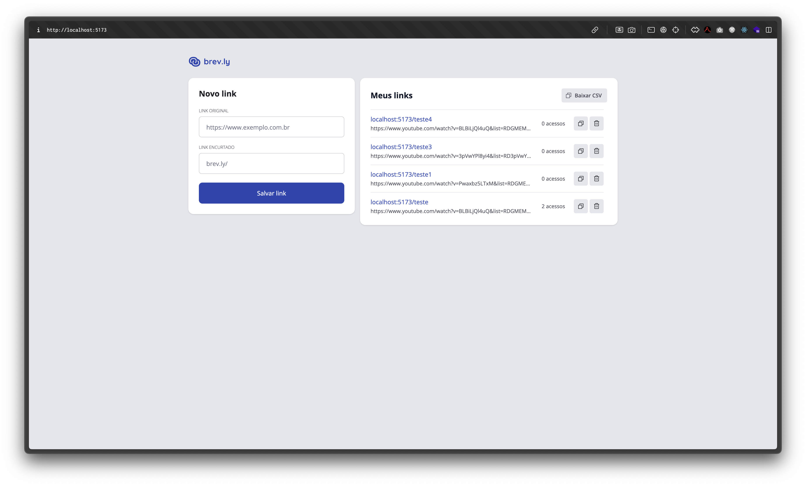
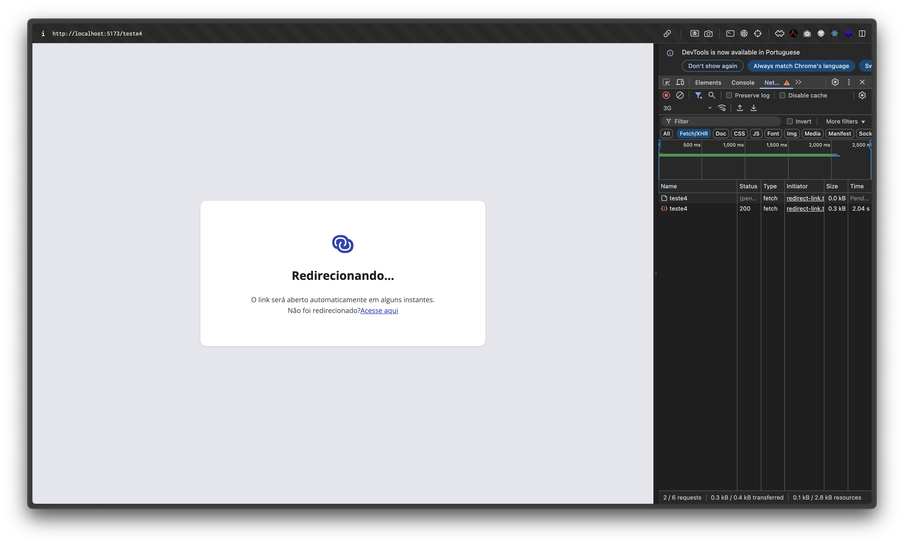

# brev.ly

Brev.ly é um encurtador de links.Sua principal função é armazenar um link extenso e disponibilizar um acesso facilitado atravé de uma URL curta.

## 🚀 Demonstração





## ⚙️ Principais Funcionalidades:

- ✅ Cadastros de links
- ✅ Exclusão de links
- ✅ Listagem com scroll infinito (carregamento por cursores)
- ✅ Validações de cadastro
- ✅ Redirecionamento de rota a nível de cliente e api
- ✅ Exportação de CSV

## 🧰 Tecnologias utilizadas

- Linguagem/framework principal:
  - React
  - NodeJS
  - Typescript

- Bibliotecas importantes: 
  - Fastify
  - Drizzle
  - Zod
  - Dayjs
  - CSV Stringify
  - AWS sdk
  - Tailwind CSS
  - Immer
  - zustand
  - React Hook Form
  - React Router Dom

- Banco de dados:
  - PostgreSQL

- Outros: 
  - Vite
  - Vitest
  - Docker
  - Supertest

## 📦 Instalação

Clone o repositório:

```bash
git clone https://github.com/matheusvieiragoncalves/pos-link-shortener
cd pos-link-shortener
```

### Variaveis ambientes

Cada pasta - `web` e `server` possui arquivos chamados de `.env.example`. Crie no mesmo diretório um `.env` e defina as mesmas variáveis de ambiente conforme o exemplo.

### Configurando o servidor:

obs.: Certifique-se de configurar as variáveis de ambiente antes de rodar os comandos abaixo

#### Com docker

```bash
cd server 

docker-compose up -d
docker compose run --rm migrate
```

#### Sem docker

obs.: será preciso criar o banco de dados manualmente.

```bash
cd server 

npm install
npm run db:migrate

npm run dev
```

#### Resultados

Após a configuração do servidor você vera uma mensagem semelhante a:

`🚀 Server is running on http://0.0.0.0:3333`

### Confiruação do cliente

```bash

cd web

npm install
np run dev

```

#### Resultados

Após a configuração do cliente você vera uma mensagem semelhante a:

```bash
  VITE v7.0.0  ready in 151 ms

  ➜  Local:   http://localhost:5173/
  ➜  Network: http://192.168.1.6:5173/
  ➜  press h + enter to show help
```
